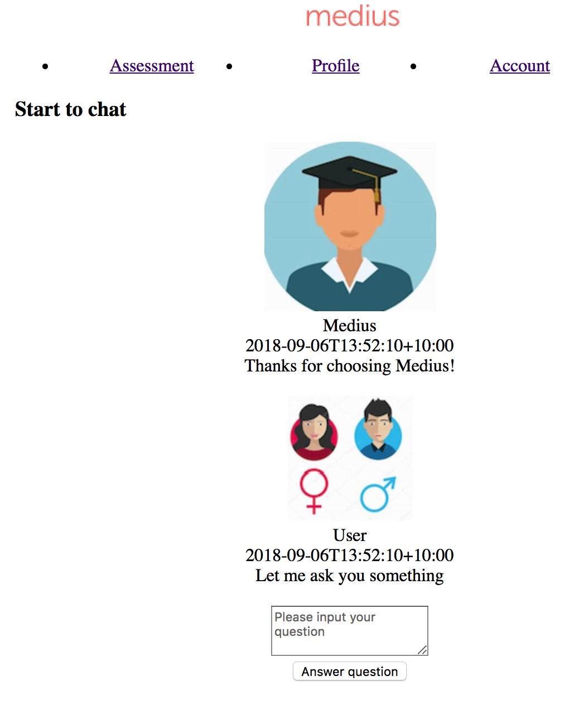
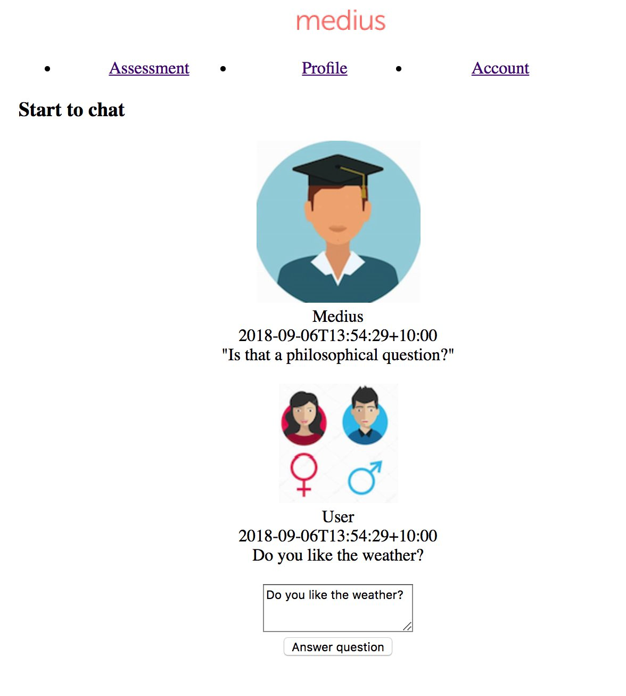
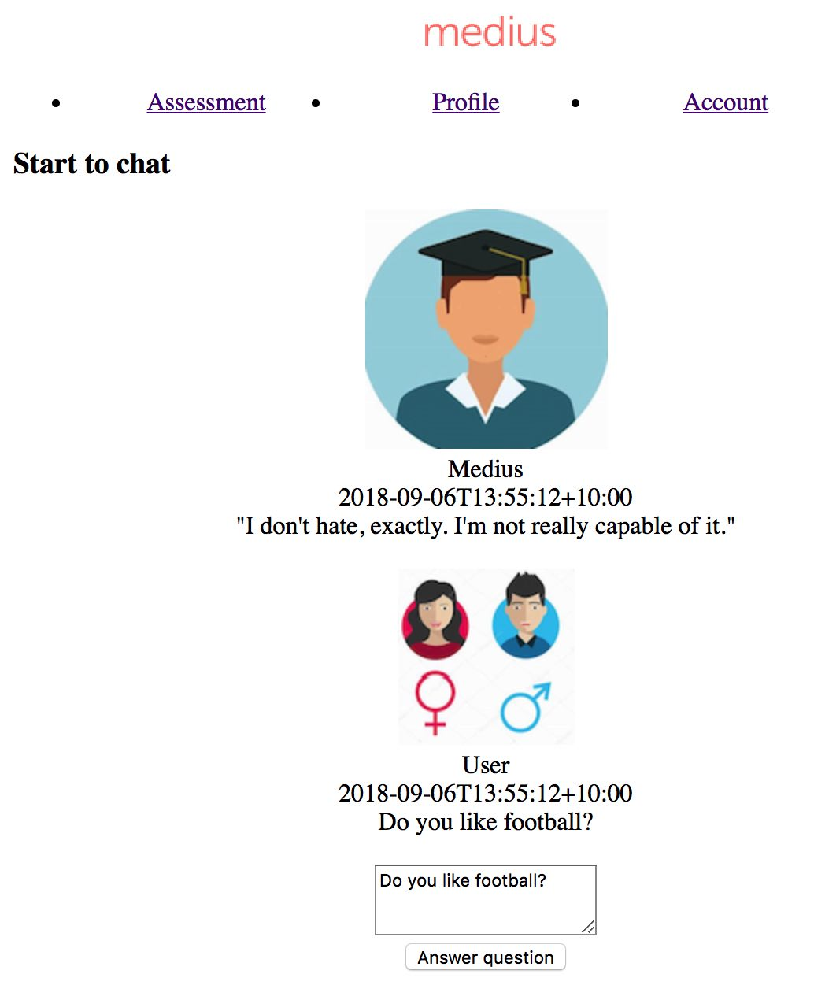

## how to use it?  

step1:
```sh
cd backend-flask and install backend
```

step2:
```sh
cd frontend-react-app and install frontend
```

step3:   
start to use the mini-chat system(for Medius)

input your question and click "answer question" button

## snapshots  

initial  



sample question1 and answer.  



sample question2 and answer.  


