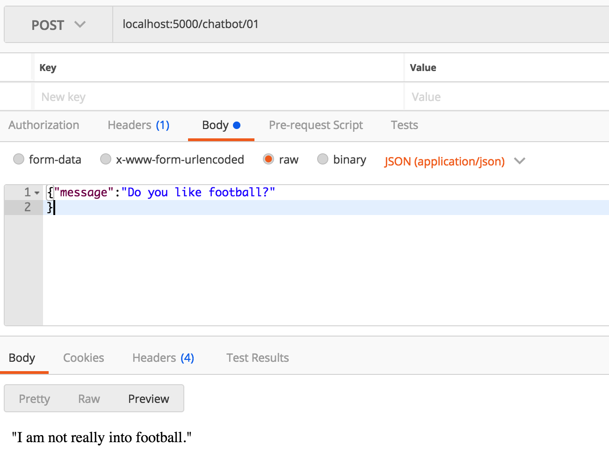

///////////////install

install chatbot
```sh
pip install chatterbot
pip install flask-restful

pip install Flask
```

```sh
sudo pip install virtualenv

virtualenv chatbot

cd chatbot
source bin/activate
```

install sqlite
```sh
ruby -e "$(curl -fsSL https://raw.githubusercontent.com/Homebrew/install/master/install)" < /dev/null 2> /dev/null

brew install sqlite
```


start to run the backend server
```sh

cd src
python3 server.py
```

///////////////test using postman

post addr
```
localhost:5000/chatbot/01
```

for post info body type, choose raw, then choose JSON(application/json) 
```json
# use postman to post json format message to the address localhost:5000/chatbot/01
# for example

{"message":"Do you like football?"
}

```

and then we can get chatting information from the server, feeling like we are chatting with a human



///////////////


