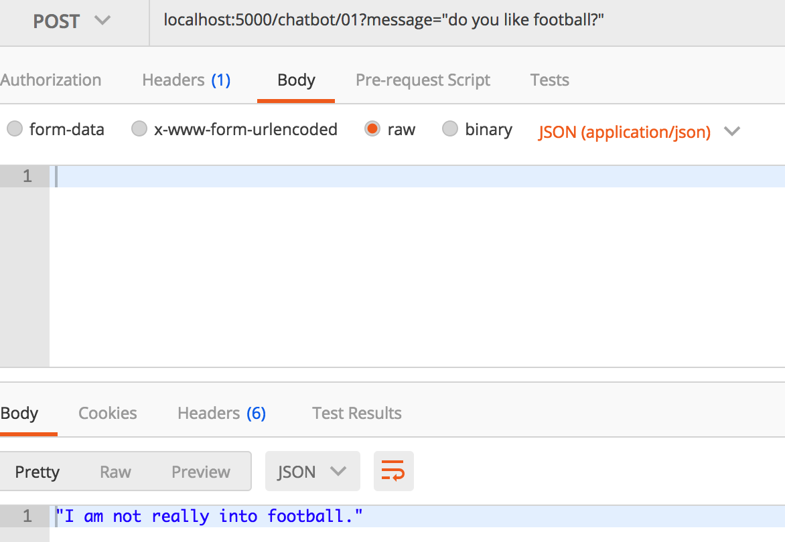

## install

install chatbot
```sh
pip install chatterbot
pip install flask-restful

pip install Flask
pip install -U flask-cors
```

```sh
sudo pip install virtualenv

virtualenv chatbot

```

install sqlite
```sh
ruby -e "$(curl -fsSL https://raw.githubusercontent.com/Homebrew/install/master/install)" < /dev/null 2> /dev/null

brew install sqlite
```

start to run the backend server
```sh

cd src
python3 server.py
```

## test using postman

post addr
```
localhost:5000/chatbot/01
```

```json
# use postman to post data to the address of "localhost:5000/chatbot/01"
# for example, when the message is "do you like football?"
# we use POST method to hit the following address

localhost:5000/chatbot/01?message="do you like football?"

```

and then we can get chatting information from the server, feeling like we are chatting with a human



///////////////


